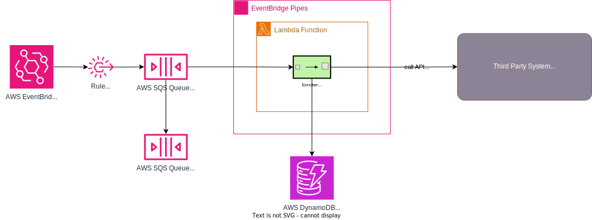

# Workbench for AWS EventBridge Pipeline with API Destinations

_Please note that this application will create AWS resources that may incur costs on your account._

This is a workbench for AWS EventBridge Pipeline with API Destinations. It demonstrates how to use EventBridge Pipeline
to build a serverless event-driven application that integrates with a third party application that can be anywhere
on the public internet.

Since (error) logging is not available in EventBridge Pipeline, this workbench also demonstrates how to use an API
Gateway as a proxy allowing to observe the events and responses that are sent to the third party API.

## Prerequisites

* [Java 17 (Corretto recommended)](https://docs.aws.amazon.com/corretto/latest/corretto-17-ug/downloads-list.html)
* [AWS CDK](https://docs.aws.amazon.com/cdk/latest/guide/getting_started.html)
* [Node.js](https://nodejs.org/en/download/) as required by the AWS CDK

You will also need to have an AWS account and have your AWS credentials configured on your machine. If you have not used
CDK before, you may need to run `cdk bootstrap` to create the resources required to deploy CDK applications.

## Build and Deploy the Application

To build and deploy the application, follow these steps:

1. Clone this repository.
2. Navigate to [webhook.site](https://webhook.site) and create a new endpoint. Copy the URL of the endpoint.
3. Run `./gradlew clean :app:optimizedJitJarAll` to build the Lambda function that will enrich the events.
4. Change to the `infra` directory by running `cd infra`.
5. Run `cdk deploy --parameters "endpointUrl=<url of the endpoint from step 2>/*"` to deploy the application.

## Test the Application

To test the application, follow these steps:

1. Navigate to your [webhook.site](https://webhook.site).
2. Run `./gradlew :app:systemTests` to send a test event to the application.

After a few seconds you should see a request appear in your webhook.site dashboard. The request should contain an
authorization header and body that was added by the Lambda function.
